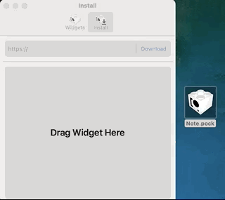

<p align="center">
  <a href="" rel="noopener">
 </a>
</p>
<h3 align="center">Note</h3>
<p align="center"> A touchbar note widget for <a href="https://github.com/pock/pock"> Pock</a>.
    <br> 
</p>
<p align="center">
  <a href="" rel="noopener">
 </a>
</p>

---

## About

If you're like me, the reminders app is too many clicks away and easy to still forget.

Using Note, you can type up a short message which will be displayed on your touchbar right above your keyboard. No more forgetting!

## Installing
Download the latest version from [Releases](https://github.com/zachmerrill/pock-note-widget/releases).

Install using Pock's drag and drop widget installer:
<p align="center">
  <a href="" rel="noopener">
 </a>
</p>

Reload Pock from the touchbar and Note will be available.

## Getting Started with XCode

These instructions will get you a copy of the project up and running on your local machine for development and testing purposes.

### Prerequisites

This project uses [CocoaPods](https://cocoapods.org/) package manager. You can install it simply using the terminal:

```
sudo gem install cocoapods
```


### Setting Up

Once you've got CocoaPods up and running, the next step is to install the [PockKit](https://github.com/pock/pockkit) pod.

In the same directory as the `Podfile`, run:
```
pod install
```

Finally, open the project using:

```
open Note.xcworkspace
```

> Opening the project using the `Note.xcodeproj` will fail to compile! You must open `Note.xcworkspace`.

### Testing
Drag and drop your compiled `Note.pock` into Pock's widget installer. Pock will ask to reload via touchbar. 

Your Note widget should now be installed and/or updated. 

## Built Using

- [PockKit](https://github.com/pock/pockkit) - Pock API
- [CocoaPods](https://cocoapods.org/) - Package Manager
- [Defaults](https://github.com/dalu93/Defaults) - Preferences Saving

## Authors

- [@zachmerrill](https://github.com/zachmerrill)
